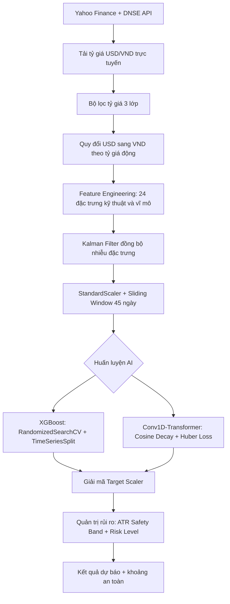

# Stock Opening Price Prediction

Hệ thống dự báo giá mở cửa phiên giao dịch tiếp theo cho các mã chứng khoán **VNM.VN** (Vinamilk), **GOOGL** (Alphabet/Google) và **META** (Meta Platforms), sử dụng kiến trúc lai ghép giữa XGBoost và Conv1D-Transformer.

Dự án được xây dựng phục vụ nghiên cứu định lượng (quantitative research), tập trung vào ba mục tiêu: độ chính xác dự báo, kiểm soát rủi ro, và tái lập kết quả.

---

## Mục lục

1. [Nguyên lý thiết kế](#1-nguyên-lý-thiết-kế)
2. [Cấu trúc thư mục](#2-cấu-trúc-thư-mục)
3. [Luồng xử lý dữ liệu](#3-luồng-xử-lý-dữ-liệu)
4. [Chi tiết các module](#4-chi-tiết-các-module)
5. [Kiến trúc mô hình AI](#5-kiến-trúc-mô-hình-ai)
6. [Hệ thống kiểm thử Backtest](#6-hệ-thống-kiểm-thử-backtest)
7. [Quản trị rủi ro](#7-quản-trị-rủi-ro)
8. [Xử lý nhiễu tỷ giá USD/VND](#8-xử-lý-nhiễu-tỷ-giá-usdvnd)
9. [Kết quả đánh giá](#9-kết-quả-đánh-giá)
10. [Hướng dẫn cài đặt và chạy](#10-hướng-dẫn-cài-đặt-và-chạy)

---

## 1. Nguyên lý thiết kế

### Dự đoán tỷ suất sinh lời thay vì giá tuyệt đối

Giá cổ phiếu là chuỗi thời gian không dừng (non-stationary). Dự đoán trực tiếp giá tuyệt đối thường dẫn đến hiện tượng mô hình chỉ sao chép giá ngày hôm trước. Thay vào đó, hệ thống dự đoán **tỷ suất sinh lời mở cửa (Opening Return)**:

$$\text{target\_return} = \frac{\text{Open}_{T} - \text{Close}_{T-1}}{\text{Close}_{T-1}}$$

Sau khi có tỷ suất dự đoán, giá mở cửa được giải mã:

$$\text{Predicted Open} = \text{Close}_{today} \times (1 + \text{target\_return}_{predicted})$$

### Cửa sổ trượt (Lookback Window)

Mô hình sử dụng chuỗi **45 phiên giao dịch liên tiếp** làm đầu vào. Đầu vào Deep Learning có dạng tensor 3 chiều: `(N, 45, 24)` — cho phép Transformer tìm kiếm mối tương quan tuần hoàn và xu hướng trung hạn.

### Chuẩn hóa StandardScaler

Hệ thống sử dụng StandardScaler (mean=0, std=1) thay cho MinMaxScaler. StandardScaler ít nhạy với giá trị ngoại lai (outliers), giữ nguyên tỷ lệ biến động thực tế và tăng tốc độ hội tụ.

---

## 2. Cấu trúc thư mục

```
Stock-Opening-Price-Prediction/
├── config/                     # Cấu hình siêu tham số Optuna (.json)
├── data/                       # Dữ liệu giá thô và đặc trưng đã xử lý (.csv)
│   └── raw/                    # Dữ liệu lịch sử DNSE/CafeF
├── docs/                       # Tài liệu bổ sung
├── logs/                       # Lịch sử dự báo và log hệ thống
├── models/                     # Mô hình đã huấn luyện (.pkl, .keras) và scalers
├── notebooks/                  # Jupyter Notebooks phân tích và giải thích
│   ├── 01_EDA.ipynb
│   ├── 02_Explain_DataLoader.ipynb
│   ├── 03_Explain_Features.ipynb
│   ├── 04_Explain_AIModels.ipynb
│   ├── 05_Explain_PredictionRunner.ipynb
│   ├── 06_Explain_WebRunner.ipynb
│   └── 07_Explain_Backtest.ipynb
├── reports/
│   └── figures/                # Biểu đồ so sánh dự báo, equity curve
├── scripts/                    # Các script thực thi chính
│   ├── run_pipeline.py         # Pipeline huấn luyện + dự báo đầy đủ
│   ├── run_training.py         # Huấn luyện Hybrid Stacking (XGBoost + Transformer)
│   ├── run_training_transformer.py  # Huấn luyện riêng Transformer
│   ├── run_tuning.py           # Tối ưu siêu tham số bằng Optuna
│   ├── run_backtest.py         # Mô phỏng giao dịch Backtest thực tế
│   └── clean_workspace.py      # Dọn dẹp tệp rác sau huấn luyện
├── src/                        # Mã nguồn cốt lõi
│   ├── data_loader.py          # Tải dữ liệu Yahoo/DNSE, quy đổi USD-VND, lọc nhiễu
│   ├── features.py             # DataTransformer: sliding window, chuẩn hóa, Kalman Filter
│   ├── ai_models.py            # Kiến trúc XGBoost và Conv1D-Transformer
│   ├── news_sentiment.py       # Phân tích cảm xúc tin tức (FinBERT/VADER)
│   ├── web/
│   │   ├── backend/            # FastAPI REST API server
│   │   └── frontend/           # Giao diện web (HTML, CSS, JS, Chart.js)
│   └── web_runner/             # Entry point khởi chạy web server
├── requirements.txt
├── LICENSE
└── README.md
```

---

## 3. Luồng xử lý dữ liệu



---

## 4. Chi tiết các module

### A. Bộ tải dữ liệu — `src/data_loader.py`

- **Dữ liệu lai ghép:** Mã VNM.VN sử dụng dữ liệu từ DNSE API (2012–2019) kết hợp Yahoo Finance (2019–nay). Mã Mỹ tải trực tiếp từ Yahoo Finance.
- **Đồng nhất tiền tệ:** Giá cổ phiếu Mỹ được quy đổi sang VND theo tỷ giá động từng ngày (`USDVND=X`).
- **Đồng bộ múi giờ:** DNSE API trả epoch millisecond. Hệ thống dùng `pytz` chuyển đổi sang `Asia/Ho_Chi_Minh` trước khi merge với Yahoo Finance, tránh lệch ngày.
- **Chỉ số vĩ mô:** VanEck Vietnam ETF (`VNM`) cho thị trường VN, S&P 500 (`^GSPC`) cho thị trường Mỹ, cùng VIX (`^VIX`), lãi suất trái phiếu (`^TNX`) và Dollar Index (`DX-Y.NYB`).

### B. Biến đổi đặc trưng — `src/features.py`

Lớp `DataTransformer` tạo ra **24 đặc trưng** từ dữ liệu giá thô:

| Nhóm | Đặc trưng | Mô tả |
|---|---|---|
| Giá | `close` | Giá đóng cửa |
| Kỹ thuật | `rsi_14`, `MACD_12_26_9`, `ema_14`, `roc_10`, `adx_14` | Các chỉ báo xu hướng và động lượng |
| Biến động | `volatility_20`, `atr_14`, `bb_lower/middle/upper` | Đo lường rủi ro và biên độ dao động |
| Khối lượng | `volume_change` | Biến động thanh khoản |
| Trễ thời gian | `lag_1`, `lag_2`, `lag_3` | Giá đóng cửa 1–3 phiên trước |
| Nội phiên | `intraday_return` | Biến động trong ngày giao dịch trước |
| Vĩ mô | `market_return`, `vix`, `treasury_yield`, `dollar_index` | Bối cảnh thị trường toàn cầu |
| Cảm xúc | `sentiment_score`, `news_volume` | Phân tích tin tức FinBERT/VADER |

Sau khi tính toán, hệ thống áp dụng **Kalman Filter** để đồng bộ và lọc nhiễu trên các đặc trưng, đo lường hiệu quả bằng hệ số tương quan Pearson.

### C. Phân tích cảm xúc — `src/news_sentiment.py`

Thu thập tin tức từ yfinance (quốc tế) và CafeF RSS (tiếng Việt). Dịch sang tiếng Anh theo batch qua `deep-translator`, chấm điểm bằng FinBERT (hoặc fallback VADER) và tổng hợp thành `sentiment_score` và `news_volume`.

### D. Tối ưu siêu tham số — `scripts/run_tuning.py`

Sử dụng framework Optuna với thuật toán TPE (Tree-structured Parzen Estimator) để dò tìm cấu hình Transformer tối ưu riêng cho từng mã cổ phiếu. Kết quả lưu vào `config/best_transformer_params_{ticker}.json`. Nếu cấu hình chưa tồn tại hoặc bị lỗi, hệ thống sẽ fallback sang tham số mặc định an toàn.

---

## 5. Kiến trúc mô hình AI

Hệ thống sử dụng hai mô hình chạy song song, kết hợp qua cơ chế **Hybrid Stacking**:

### XGBoost (Extreme Gradient Boosting)

- Đầu vào làm phẳng từ tensor 3D `(45, 24)` thành vector `(1080,)`, nối thêm latent features trích xuất từ lớp áp chót của Transformer.
- Tối ưu tham số bằng `RandomizedSearchCV` kết hợp `TimeSeriesSplit` (5 folds), tránh data leakage.

### Conv1D-Transformer (Deep Architecture)

| Lớp | Chi tiết |
|---|---|
| Input | Tensor `(45, 24)` |
| Conv1D | 128 filters, kernel_size=3, L2 regularization |
| LayerNorm | Ổn định phân phối sau Conv1D |
| Positional Embedding | Mã hóa thứ tự thời gian |
| Multi-Head Attention (x2) | 8 heads, key_dim=`d_model`, dropout=0.3 |
| Residual + LayerNorm | Chống suy giảm gradient |
| Global Average Pooling | Gom chiều thời gian |
| Dense + Dropout | Chống overfitting |
| Output | Scalar — tỷ suất sinh lời |

Huấn luyện sử dụng **Huber Loss** (bền vững trước outliers), **Cosine Decay Scheduler** kết hợp **ReduceLROnPlateau** và **EarlyStopping** (patience=25).

### Lưu trữ mô hình

Mô hình được lưu với nhãn thời gian `_YYYYMMDD_HHMM` phục vụ lưu vết lịch sử, đồng thời ghi đè lên file tên chuẩn (ví dụ: `transformer_model_VNM.VN.keras`) để backend luôn tải được phiên bản mới nhất.

---

## 6. Hệ thống kiểm thử Backtest

Module `scripts/run_backtest.py` mô phỏng chiến lược giao dịch **Overnight Trading** trên tập kiểm thử out-of-sample:

**Quy tắc giao dịch:**
- Mua tại Close nếu cả hai mô hình đồng thuận báo tăng > +0.25%.
- Bán toàn bộ tại Open phiên hôm sau.
- Nếu không có tín hiệu đồng thuận: giữ tiền mặt.

**Ma sát thị trường (Market Friction):**

| Thị trường | Phí giao dịch | Slippage |
|---|---|---|
| Việt Nam (VNM.VN) | 0.20% (bao gồm thuế TNCN) | 0.10% |
| Mỹ (GOOGL, META) | 0.10% | 0.05% |

**Walk-Forward Validation:** Tập Test được chia thành 3 rolling window độc lập để kiểm tra tính ổn định qua các chu kỳ thị trường khác nhau.

### Kết quả Backtest — VNM.VN (693 phiên, 2023–2026)

| Chỉ số | Chiến lược Hybrid | Buy & Hold |
|---|---|---|
| Tổng lợi nhuận | -0.62% | -5.97% |
| Sharpe Ratio | -0.13 | — |
| Max Drawdown | -2.98% | -31.70% |
| Số lệnh | 5 | 1 |

Chiến lược bảo vệ vốn hiệu quả: Max Drawdown chỉ -2.98% so với -31.70% của Buy & Hold. Trong giai đoạn thị trường giảm mạnh (Window 2), chiến lược đã tự động đứng ngoài hoàn toàn bằng tiền mặt.

---

## 7. Quản trị rủi ro

Hệ thống không chỉ đưa ra giá dự báo đơn lẻ mà tích hợp pipeline quản lý rủi ro:

**Dải an toàn ATR (ATR Safety Band):**

$$\text{Khoảng giá an toàn} = \text{Giá dự báo} \pm 1.5 \times \text{ATR}_{14}$$

**Phân loại mức độ rủi ro:**

| Mức | Điều kiện | Ý nghĩa |
|---|---|---|
| Thấp | Biến động < 1.5% | Thị trường ổn định |
| Trung bình | 1.5% – 3.0% | Cần thận trọng |
| Cao | > 3.0% | Rủi ro cao, hạn chế giao dịch |

---

## 8. Xử lý nhiễu tỷ giá USD/VND

Nguồn Yahoo Finance (`USDVND=X`) có lỗi dữ liệu nghiêm trọng tại một số phiên lịch sử — tỷ giá bị ghi nhận sai lệch hàng nghìn lần (ví dụ: 3.210 thay vì 21.000), tạo ra biến động ảo lên tới +562% trong một ngày.

Hệ thống áp dụng **bộ lọc 3 lớp**:
1. **Phát hiện thiếu bậc:** Nếu `rate < 1000`, nhân với `1000` (ví dụ: 21.0 → 21000).
2. **Loại bỏ dị biệt:** Đánh dấu `NaN` cho giá trị nằm ngoài khoảng `[15000, 28000]` — biên độ lịch sử 15 năm.
3. **Điền khuyết:** Áp dụng `.ffill()` và `.bfill()` lấp đầy `NaN` bằng giá trị hợp lệ gần nhất.

Kết hợp với StandardScaler, mô hình hoàn toàn không bị ảnh hưởng bởi outliers còn sót lại.

---

## 9. Kết quả đánh giá

Sai số trên tập kiểm thử (Test Set) độc lập, sau khi tích hợp đầy đủ các đặc trưng vĩ mô và cảm xúc tin tức:

### Vinamilk (VNM.VN)

| Mô hình | MAE (VND) | MAPE |
|---|---|---|
| XGBoost | 219,57 | 0.37% |
| Transformer | 220,59 | 0.37% |

### Alphabet (GOOGL)

| Mô hình | MAE (VND) | MAE (USD) | MAPE |
|---|---|---|---|
| XGBoost | 40.760,08 | ~$1.60 | 0.84% |
| Transformer | 43.222,86 | ~$1.70 | 0.89% |

### Meta Platforms (META)

| Mô hình | MAE (VND) | MAE (USD) | MAPE |
|---|---|---|---|
| XGBoost | 190.992,80 | ~$7.52 | 1.31% |
| Transformer | 156.554,49 | ~$6.16 | 1.08% |

Toàn bộ các mô hình đều duy trì sai lệch trung bình quanh mốc ~1%. VNM.VN và GOOGL đạt dưới 0.9%.

---

## 10. Hướng dẫn cài đặt và chạy

### Yêu cầu

- Python 3.10 trở lên
- Hệ điều hành: Windows (đã kiểm thử), Linux/macOS (tương thích)

### Cài đặt

```powershell
# Tạo và kích hoạt môi trường ảo
python -m venv .venv
.venv\Scripts\activate

# Cài đặt thư viện
pip install -r requirements.txt
```

### Chạy pipeline huấn luyện và dự báo

```powershell
# Huấn luyện đầy đủ pipeline (tải dữ liệu, xử lý đặc trưng, huấn luyện, dự báo)
python scripts/run_pipeline.py

# Huấn luyện riêng mô hình Hybrid Stacking
python scripts/run_training.py

# Tối ưu siêu tham số bằng Optuna (cho 1 mã cụ thể)
python scripts/run_tuning.py VNM.VN

# Chạy backtest mô phỏng giao dịch
python scripts/run_backtest.py VNM.VN
```

### Chạy web server

```powershell
python src/web_runner/run_web.py
# Truy cập http://127.0.0.1:8000/
```

### Ghi chú

- Lần chạy đầu tiên sẽ tải trọng số FinBERT (~400MB) từ HuggingFace Hub.
- Tin tức tiếng Việt (CafeF RSS) được dịch sang tiếng Anh qua `deep-translator` trước khi phân tích cảm xúc.
- Biểu đồ kết quả lưu tại `reports/figures/`.
- Lịch sử dự báo lưu tại `logs/predictions_history.txt`.

---

## License

MIT License — xem file [LICENSE](LICENSE) để biết chi tiết.
