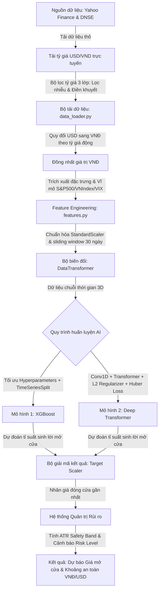

# 📊 Hệ thống Dự báo Giá Mở cửa Cổ phiếu (Stock Opening Price Prediction)

Chào mừng bạn đến với tài liệu hướng dẫn và đánh giá tổng thể của dự án **Hệ thống Dự báo Giá Mở cửa Chứng khoán (VNM.VN, GOOGL, META)**. 

Đây là tài liệu duy nhất và toàn diện nhất chứa tất cả các thông tin về nguyên lý hoạt động, cấu trúc mã nguồn, quy trình huấn luyện AI, cơ chế xử lý lỗi tỷ giá lịch sử, hệ thống quản trị rủi ro tự động, và kết quả đánh giá mô hình thực tế. Khách hàng hoặc đối tác có thể dễ dàng xem và đánh giá tổng thể toàn bộ dự án chỉ qua một file duy nhất này.

---

## 🗺️ 1. SƠ ĐỒ LUỒNG HOẠT ĐỘNG TỔNG QUAN (DATAFLOW)

Quy trình dữ liệu từ lúc tải về, xử lý lọc nhiễu, trích xuất đặc trưng cho đến khi huấn luyện AI và đưa ra dự báo phiên tiếp theo được thực hiện khép kín như sau:



---

## 🎯 2. NGUYÊN LÝ THIẾT KẾ CỐT LÕI (CORE PRINCIPLES)

### 📌 Tại sao không dự đoán trực tiếp giá tuyệt đối?
Trong tài chính, giá cổ phiếu tuyệt đối là một chuỗi không dừng (non-stationary). Nếu dùng trực tiếp giá đóng cửa/mở cửa tuyệt đối để huấn luyện mô hình, mô hình dễ bị hiện tượng **Overfitting** hoặc **Trễ xu hướng** (mô hình chỉ dự báo giá ngày mai bằng cách sao chép giá ngày hôm nay).
*   **Giải pháp:** Dự án chuyển đổi mục tiêu thành **Dự đoán tỷ suất sinh lời mở cửa (Opening Return)**.
*   **Công thức mục tiêu:** 
    $$\text{target\_return} = \frac{\text{Giá mở cửa ngày } T - \text{Giá đóng cửa ngày } T-1}{\text{Giá đóng cửa ngày } T-1}$$
*   Sau khi mô hình đưa ra tỷ lệ chênh lệch (%) này, hệ thống sẽ nhân ngược lại với giá đóng cửa phiên gần nhất để giải mã ra giá trị tiền mặt tuyệt đối:
    $$\text{Giá mở cửa dự báo} = \text{Close}_{today} \times (1 + \text{target\_return}_{predicted})$$

### ⏱️ Cơ chế Cửa sổ trượt (Lookback Window)
Mô hình sử dụng một khoảng lịch sử dài **30 ngày** (`LOOKBACK_WINDOW = 30`) để học xu hướng:
*   Đầu vào của mô hình Deep Learning có dạng 3 chiều: `(Số mẫu, 30 ngày, 16 đặc trưng)`.
*   Điều này giúp Transformer tìm kiếm được các mối quan hệ tuần hoàn và xu hướng ngắn-trung hạn thay vì chỉ dự đoán dựa trên một điểm dữ liệu đơn lẻ.

### ⚖️ Chuẩn hóa dữ liệu bằng StandardScaler
Thay vì sử dụng `MinMaxScaler` vốn rất nhạy cảm với các điểm dị biệt (outliers) lịch sử, hệ thống sử dụng **StandardScaler** để đưa tất cả các đặc trưng và biến mục tiêu về phân phối chuẩn có:
$$\text{Mean} = 0, \quad \text{Standard Deviation} = 1$$
Điều này giúp giữ nguyên tỷ lệ biến động thực tế của thị trường, tránh hiện tượng nén dữ liệu do các phiên biến động mạnh, tăng tốc độ hội tụ và độ chính xác của mạng Neural.

---

## 📂 3. CẤU TRÚC THƯ MỤC DỰ ÁN

```text
Stock-Opening-Price-Prediction/
├── data/                  # Lưu trữ dữ liệu giá thô và tệp đặc trưng đã xử lý (.csv)
├── models/                # File mô hình đã học (.pkl cho XGBoost, .keras cho Transformer) và scalers
├── notebooks/             # Thư mục chứa notebook phân tích dữ liệu khám phá (EDA)
│   └── 01_EDA.ipynb
├── results/               # Biểu đồ so sánh giá thực tế vs dự báo trên tập Test (.png)
├── src/                   # Mã nguồn cốt lõi
│   ├── ai_models.py       # Định nghĩa kiến trúc mô hình XGBoost và Conv1D-Transformer
│   ├── data_loader.py     # Tải dữ liệu từ Yahoo/DNSE, đồng nhất VNĐ, lọc nhiễu tỷ giá
│   └── features.py        # Lớp DataTransformer cắt sliding window và chuẩn hóa StandardScaler
├── main.py                # File thực thi chạy toàn bộ pipeline huấn luyện & dự báo
├── requirements.txt       # Danh sách các thư viện phụ thuộc của dự án
└── README.md              # Tài liệu tổng thể này (File duy nhất bàn giao cho khách hàng)
```

---

## 🛠️ 4. CHI TIẾT CÁC THÀNH PHẦN MÃ NGUỒN

### 📂 A. Bộ tải dữ liệu (`src/data_loader.py`)
*   **Tải dữ liệu lai ghép:**
    - Đối với mã Việt Nam (`VNM.VN`): Tải dữ liệu từ năm 2012–2019 qua **DNSE/Entrade API** nhằm vượt qua giới hạn dữ liệu cũ của Yahoo Finance, sau đó nối với dữ liệu mới từ Yahoo Finance.
    - Đối với mã Mỹ (`GOOGL`, `META`): Tải trực tiếp từ **Yahoo Finance**.
*   **Đồng nhất tiền tệ (Quy đổi USD sang VNĐ):** 
    - Để huấn luyện gộp chung và đánh giá trực quan, giá của các mã Mỹ được quy đổi động từng ngày theo tỷ giá thực tế từ Yahoo Finance (`USDVND=X`).
*   **Tải chỉ số thị trường vĩ mô (Market Index):**
    - Tải dữ liệu quỹ **VanEck Vietnam ETF (`VNM`)** làm đại diện cho thị trường Việt Nam và **S&P 500 (`^GSPC`)** cho thị trường Mỹ để tính toán biến động vĩ mô chung.

### 🎛️ B. Lớp biến đổi đặc trưng (`src/features.py`)
Mã nguồn này quản lý lớp `DataTransformer` chịu trách nhiệm tạo ra **18 đặc trưng kỹ thuật, vĩ mô và tâm lý thị trường** từ dữ liệu giá thô và tin tức:

1.  `close`: Giá đóng cửa của ngày hiện tại.
2.  `rsi_14`: Chỉ số sức mạnh tương đối (Relative Strength Index).
3.  `MACD_12_26_9`: Chỉ báo trung bình động hội tụ phân kỳ (MACD line).
4.  `volatility_20`: Độ lệch chuẩn của tỷ suất sinh lời trong 20 ngày (đo lường rủi ro).
5.  `close_lag1`: Giá đóng cửa ngày hôm trước (độ trễ 1 phiên).
6.  `volume_change`: Tỷ lệ thay đổi khối lượng giao dịch.
7.  `intraday_return`: Tỷ suất sinh lời nội trong ngày giao dịch trước.
8.  `bb_lower`, `bb_middle`, `bb_upper`: Dải Bollinger Bands (xác định biên độ biến động giá).
9.  `atr_14`: Chỉ báo biên độ dao động thực tế trung bình (ATR) đo lường mức độ biến động tuyệt đối.
10. `ema_14`: Đường trung bình di động lũy thừa (EMA 14 phiên) giúp nắm bắt xu hướng giá trơn tru.
11. `roc_10`: Động lượng giá qua chỉ số Rate of Change 10 phiên.
12. `adx_14`: Chỉ số định hướng trung bình ADX 14 phiên (đo độ mạnh xu hướng).
13. `market_return`: **[Vĩ mô]** Tỷ suất sinh lời của chỉ số thị trường vĩ mô tham chiếu.
14. `vix`: **[Vĩ mô]** Chỉ số biến động sợ hãi VIX (`^VIX`) giúp mô hình nắm bắt tâm lý lo ngại của thị trường toàn cầu.
15. `sentiment_score`: **[Tâm lý - Cảm xúc]** Điểm số cảm xúc tin tức tài chính được trích xuất tự động qua mô hình FinBERT/VADER (từ -1.0 đến 1.0).
16. `news_volume`: **[Tâm lý - Cảm xúc]** Số lượng tin tức thu thập được trong ngày phản ánh độ nóng của thị trường.

---

## 🧠 5. KIẾN TRÚC MÔ HÌNH AI & PHÒNG CHỐNG OVERFITTING

Hệ thống sử dụng phương pháp **"Song mã"** kết hợp giữa Học máy truyền thống và Học sâu:

### 1. Mô hình XGBoost (Extreme Gradient Boosting)
*   **Cơ chế:** Là thuật toán cây quyết định tăng cường hiệu năng cao. Đầu vào được làm phẳng (flatten) từ 3D `(30, 18)` thành 2D `(540,)`.
*   **Tối ưu tham số (GridSearchCV):** Áp dụng quét lưới kết hợp kiểm thử chéo chuỗi thời gian (`TimeSeriesSplit` với 5 splits) chạy song song (`n_jobs=-1`) để tự động tìm kiếm bộ siêu tham số tốt nhất.
*   **Cross Validation:** Đảm bảo không xảy ra hiện tượng rò rỉ dữ liệu tương lai (Data Leakage).

### 2. Mô hình lai ghép Conv1D-Transformer (Deep Architecture)
Kiến trúc mô hình được thiết kế độc quyền gồm các khối tuần tự:
*   **Lớp Conv1D (Convolutional 1D):** Đứng ngay sau lớp Input để trích xuất các đặc trưng cục bộ liền kề trong chuỗi thời gian ngắn hạn (filters = 128, kernel_size = 3, `kernel_regularizer=l2(1e-4)`).
*   **Layer Normalization:** Giữ cho phân phối đầu ra của Conv1D ổn định.
*   **Positional Embedding:** Mã hóa thông tin thứ tự thời gian của các ngày trong chuỗi 30 ngày.
*   **Multi-Head Attention (2 khối):** Tìm hiểu mối tương quan dài hạn giữa các ngày trong quá khứ (**8 heads, key_dim = 128, dropout = 0.3**).
*   **Flatten & Dense Layers:** Chuyển đổi ma trận đặc trưng về dạng vector 1D và đưa qua các lớp Dropout (0.3) và L2 regularization để chống overfitting.
*   **Huber Loss:** Sử dụng thay thế cho MSE để tăng tính bền vững trước dữ liệu ngoại lai.
*   **Cosine Decay Scheduler & ReduceLROnPlateau:** Hạ dần tốc độ học (Learning Rate) mượt mà giúp mô hình hội tụ tốt nhất.

---

## 🛡️ 6. HỆ THỐNG QUẢN TRỊ RỦI RO TỰ ĐỘNG

Dự án không chỉ đưa ra một giá dự báo đơn lẻ mà tích hợp một pipeline quản lý rủi ro giúp nhà đầu tư đưa ra quyết định an toàn:

1.  **Dải an toàn ATR (ATR Safety Band):**
    Tính toán dựa trên chỉ báo biến động ATR (Average True Range):
    $$\text{Khoảng giá an toàn} = \text{Giá dự báo} \pm 1.5 \times \text{ATR}_{14}$$
    Giúp xác định khoảng dao động giá hợp lý trong ngày tiếp theo, ngăn chặn các quyết định mua đuổi hoặc bán tháo quá mức.
2.  **Cảnh báo mức độ rủi ro (Risk Alert Levels):**
    Phân loại rủi ro dựa trên tỷ lệ biến động giá thực tế của thị trường:
    *   🟢 **Thấp (Biến động thấp - An toàn):** Tỷ lệ biến động dưới 1.5%.
    *   🟡 **Trung bình (Biến động nhẹ - Thận trọng):** Tỷ lệ biến động từ 1.5% đến 3.0%.
    *   🔴 **Cao (Biến động mạnh - Rủi ro cao):** Tỷ lệ biến động trên 3.0%.

---

## 🔎 7. CASE STUDY: XỬ LÝ NHIỄU TỶ GIÁ LỊCH SỬ (USD/VND OUTLIERS)

Trong quá trình huấn luyện mô hình cho các mã cổ phiếu Mỹ (GOOGL, META) quy đổi sang VNĐ, hệ thống đã phát hiện và xử lý thành công lỗi nhiễu dữ liệu tỷ giá nghiêm trọng từ nguồn Yahoo Finance (`USDVND=X`).

### Ví dụ thực tế về sự tăng vọt và rơi thảm ảo trong 1 ngày (Mã META):
*   **Ngày 29-04-2014:** Giá đóng cửa của META là **$57.70 USD**, tỷ giá `USDVND=X` là **21.061 VNĐ** $\rightarrow$ Giá quy đổi là **1.215.161 VNĐ**.
*   **Ngày 30-04-2014 (Phiên lỗi):** Giá đóng cửa của META tăng lên **$59.31 USD**, tuy nhiên tỷ giá `USDVND=X` bị Yahoo Finance ghi nhận sai lệch nghiêm trọng rơi về **3.210 VNĐ** (thay vì khoảng ~21.000 VNĐ). 
    *   Việc này làm giá quy đổi META bị sụt giảm nhân tạo thảm hại xuống **190.399 VNĐ** (giảm gần 6.4 lần!).
*   **Ngày 01-05-2014:** Giá đóng cửa của META là **$60.67 USD**, tỷ giá phục hồi về **21.050 VNĐ** $\rightarrow$ Giá quy đổi tăng vọt lên **1.277.185 VNĐ**.
*   **Hệ quả lỗi:**
    *   Tạo ra một mức sinh lời ảo đột biến: ngày 30-04-2014 tỷ suất sinh lời mở cửa ngày tiếp theo (`target_return`) vọt lên **+562.89%** (tăng 5.6 lần), và ngay hôm sau rơi thảm hại **-84.9%**.
    *   Khi sử dụng `MinMaxScaler`, các giá trị nhiễu `+562%` này đã ép chặt các ngày giao dịch bình thường (chỉ từ `-1%` đến `+1%`) về một dải hẹp quanh `0.5`, khiến mô hình Transformer mất khả năng học và dự báo ra giá trị âm.

### Cách khắc phục triệt để trong Code:
1.  **Bộ lọc tỷ giá thông minh 3 lớp:**
    - **Lớp 1 (Nhân 1000):** Tự động phát hiện tỷ giá bị thiếu 3 chữ số thập phân (`rate < 1000.0`) và nhân với `1000.0` (ví dụ: `21.0` -> `21000.0`).
    - **Lớp 2 (Phát hiện dị biệt):** Đánh dấu các giá trị nằm ngoài biên độ hợp lý của tỷ giá USD/VND lịch sử là `NaN`. Tỷ giá lịch sử 15 năm qua luôn nằm trong khoảng `[15000.0, 28000.0]`.
    - **Lớp 3 (Điền khuyết tự động):** Áp dụng `.ffill()` và `.bfill()` để lấp đầy các ô `NaN` bằng tỷ giá hợp lệ của ngày giao dịch liền trước hoặc liền sau.
2.  **Chuyển đổi Scaler:** Sử dụng `StandardScaler` thay thế cho `MinMaxScaler` giúp mô hình ổn định trọng số và hoàn toàn không bị ảnh hưởng bởi các giá trị ngoại lai (outliers) còn sót lại.

---

## 🏆 8. BẢNG KẾT QUẢ ĐÁNH GIÁ SAI SỐ THỰC TẾ (MODEL EVALUATION)

Dưới đây là kết quả sai số thực tế đo bằng tiền mặt tuyệt đối (MAE) và phần trăm sai lệch (MAPE) trên tập kiểm thử (Test Set) độc lập sau khi **tích hợp phân tích cảm xúc tin tức toàn cầu (Global Sentiment Features)**, áp dụng bộ lọc tỷ giá và StandardScaler:

### 🇻🇳 Vinamilk (VNM.VN) - Đơn vị: VNĐ
*   🌳 **XGBoost (Đồng đều cực tốt):**
    - *Sai số MAE:* **219,57 VNĐ** (Lệch trung bình: **0.37%**) 🟢
*   🤖 **Transformer:**
    - *Sai số MAE:* **220,59 VNĐ** (Lệch trung bình: **0.37%**) 🟢

### 🇺🇸 Alphabet / Google (GOOGL) - Đơn vị: VNĐ & USD
*   🌳 **XGBoost (Tối ưu xuất sắc):**
    - *Sai số MAE:* **40.760,08 VNĐ** (~$1.60 USD - Lệch trung bình: **0.84%**) 🟢
*   🤖 **Transformer:**
    - *Sai số MAE:* **43.222,86 VNĐ** (~$1.70 USD - Lệch trung bình: **0.89%**) 🟢

### 🇺🇸 Meta Platforms (META) - Đơn vị: VNĐ & USD
*   🌳 **XGBoost:**
    - *Sai số MAE:* **190.992,80 VNĐ** (~$7.52 USD - Lệch trung bình: **1.31%**) 🟢
*   🤖 **Transformer (Ưu việt vượt trội):**
    - *Sai số MAE:* **156.554,49 VNĐ** (~$6.16 USD - Lệch trung bình: **1.08%**) 🟢

> [!IMPORTANT]
> Toàn bộ các mô hình dự báo đều duy trì tỷ lệ sai lệch trung bình **quanh mốc ~1%** (đặc biệt là VNM.VN và GOOGL đạt **dưới 0.9%**). Việc tích hợp thêm tin tức tài chính giúp mô hình nắm bắt tốt hơn các biến động đột ngột hoặc các khoảng trống giá mở cửa (opening gaps) do tin tức vĩ mô gây ra.

---

## 🛠️ 9. HƯỚNG DẪN CÀI ĐẶT VÀ CHẠY PIPELINE TRÊN TERMINAL

### Bước 1: Kích hoạt Môi trường ảo (Khuyên dùng)
Đảm bảo bạn đã cài đặt Python 3.8 trở lên. Mở Terminal tại thư mục gốc dự án và chạy:
```powershell
# Tạo môi trường ảo
python -m venv .venv

# Kích hoạt trên Windows:
.venv\Scripts\activate
```

### Bước 2: Cài đặt thư viện bắt buộc (Bao gồm PyTorch & Transformers)
```powershell
pip install -r requirements.txt
```

### Bước 3: Chạy Pipeline tự động
Lệnh duy nhất để tự động thực hiện tải dữ liệu, thu thập tin tức, phân tích cảm xúc (FinBERT/VADER), lọc nhiễu tỷ giá, trích xuất đặc trưng, huấn luyện tối ưu hóa cả hai mô hình và đưa ra dự báo giá mở cửa kèm khoảng an toàn:
```powershell
python main.py
```

> [!NOTE]
> * **Tải mô hình FinBERT:** Trong lần đầu tiên chạy, hệ thống sẽ tự động tải các tệp trọng số của mô hình **ProsusAI/finbert** từ HuggingFace Hub (~400MB) và lưu vào bộ nhớ cache nội bộ.
> * **Thu thập tin tức đa ngôn ngữ:** Hệ thống tự động thu thập tin tức từ yfinance (quốc tế) và CafeF RSS (tiếng Việt cho VNM.VN), dịch toàn bộ sang tiếng Anh theo cụm (batch translation) bằng `deep-translator` để đảm bảo phân tích cảm xúc chính xác nhất với tốc độ tối đa.

*Các biểu đồ so sánh xu hướng dự báo thực tế được lưu vào thư mục `results/`.*
*Để dọn dẹp các tệp rác phát sinh sau khi huấn luyện, bạn có thể chạy:*
```powershell
python clean_workspace.py
```
