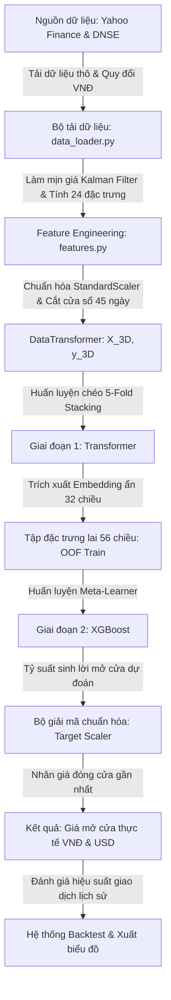

# 📘 CẨM NANG TOÀN DIỆN VỀ DỰ ÁN & ĐỊNH NGHĨA THUẬT NGỮ (MASTER GUIDE)

Tài liệu này là cẩm nang hợp nhất từ toàn bộ các tài liệu hướng dẫn, ghi chú kỹ thuật, lịch sử phát triển và thuật ngữ chứng khoán của dự án **Dự đoán Giá Mở Cửa Cổ Phiếu (Stock Opening Price Prediction)**.

---

## 🗺️ PHẦN 1: BẢN ĐỒ KIẾN TRÚC & LUỒNG HOẠT ĐỘNG (DATAFLOW)

Dữ liệu di chuyển qua hệ thống theo quy trình tuyến tính khép kín dưới đây:



---

## 🔬 PHẦN 2: CHI TIẾT CÁC THÀNH PHẦN KỸ THUẬT (COMPONENTS)

### 1. Bộ tải dữ liệu thô (`src/data_loader.py`)
Hệ thống kết hợp thông minh các nguồn dữ liệu trực tuyến nhằm tối ưu hóa độ dài lịch sử huấn luyện:
*   **Cổ phiếu Việt Nam (`VNM.VN`):** Để vượt qua giới hạn dữ liệu ngắn hạn của Yahoo Finance (thường chỉ có từ 2019 trở đi), hệ thống tự động gọi **DNSE/Entrade API** để tải thêm **1.868 phiên** từ năm 2012 đến 2019, ghép nối với dữ liệu mới từ Yahoo Finance tạo thành tập dữ liệu dài **3.535 phiên** (~14 năm lịch sử).
*   **Cổ phiếu công nghệ Mỹ (`GOOGL`, `META`):** Tải trực tiếp từ **Yahoo Finance API** kể từ năm 2010 (GOOGL) và 2012 (META khi bắt đầu IPO).
*   **Đồng nhất tiền tệ:** Toàn bộ giá của `GOOGL` và `META` được nhân với tỷ giá USD/VND động (tải trực tiếp từ Yahoo Finance ticker `USDVND=X` hoặc API dự phòng) để chuyển đổi hoàn toàn sang **VNĐ** giúp mô hình học và so sánh dễ dàng.
*   **Chỉ số vĩ mô thế giới:** Hệ thống tự động tải:
    *   Chỉ số quỹ ETF đại diện Việt Nam (`VNM`) hoặc chỉ số S&P 500 (`^GSPC`) làm đặc trưng tham chiếu thị trường chung (`market_return`).
    *   Chỉ số đo lường nỗi sợ hãi toàn cầu **VIX (`^VIX`)**.
    *   Lợi suất trái phiếu chính phủ Mỹ 10 năm **Bond Yield (`^TNX`)**.
    *   Chỉ số sức mạnh đồng USD **Dollar Index (`DX-Y.NYB`)**.

---

### 2. Bộ biến đổi dữ liệu & Cửa sổ trượt (`src/features.py`)
Quản lý lớp `DataTransformer` chịu trách nhiệm xử lý các đặc trưng:
*   **Tại sao không dự đoán trực tiếp giá tuyệt đối?** Giá tuyệt đối (ví dụ: 60.000đ hay 80.000đ) là một chuỗi không dừng (non-stationary), dễ gây ra hiện tượng **Overfitting** và **Trễ xu hướng** (mô hình học máy chỉ học cách lặp lại giá ngày hôm qua). Vì thế dự án chuyển sang dự đoán **Tỷ suất sinh lời mở cửa (`target_return`)**:
    $$\text{target\_return} = \frac{\text{Giá mở cửa ngày mai} - \text{Giá đóng cửa hôm nay}}{\text{Giá đóng cửa hôm nay}}$$
*   **Cửa sổ trượt 45 ngày (`LOOKBACK_WINDOW = 45`):** Mô hình Deep Learning sẽ quan sát liên tiếp **45 phiên giao dịch quá khứ** (~2.5 tháng) làm đầu vào để dự báo phiên kế tiếp. Đầu vào mô hình có dạng ma trận 3 chiều: `(Số mẫu, 45 ngày, 24 đặc trưng)`.
*   **Làm mịn dữ liệu (Kalman Filter):** Trước khi tính toán các chỉ báo kỹ thuật, hệ thống chạy **Bộ lọc Kalman** trên giá đóng cửa thô để khử nhiễu dao động ngắn hạn của sàn chứng khoán, tạo ra đường giá xu hướng mượt mà `close_smoothed`.
*   **Chuẩn hóa dữ liệu:** Sử dụng `StandardScaler` (đưa dữ liệu về trung bình = 0, độ lệch chuẩn = 1) độc lập cho tập đặc trưng đầu vào (`feature_scaler`) và biến mục tiêu (`target_scaler`) để tăng tốc độ hội tụ và tránh ảnh hưởng bởi giá trị ngoại lai (outliers).

---

### 3. Kiến trúc mô hình học máy song hành (`src/ai_models.py`)

Hệ thống kết hợp sức mạnh của hai kiến trúc hàng đầu:

#### 🤖 A. Mô hình Deep Learning: Conv1D - Transformer Encoder
Thiết kế chuyên biệt cho dữ liệu chuỗi thời gian:
1.  **Lớp Conv1D:** Nằm ở đầu vào để trích xuất các đặc trưng cục bộ liên kề giữa các ngày (nhận diện các mẫu nến ngắn hạn).
2.  **Positional Embedding:** Nhúng yếu tố thứ tự thời gian vào ma trận dữ liệu để mô hình biết ngày nào xảy ra trước, ngày nào sau.
3.  **Khối Self-Attention (2 khối, 2 heads, key_dim=64):** Cơ chế tự chú ý tự động tìm mối liên hệ phi tuyến phức tạp giữa 45 ngày trong quá khứ.
4.  **Cổ chai 32 chiều (Dense(32)):** Nén toàn bộ thông tin học được từ Attention thành **32 đặc trưng ẩn (Embeddings)** biểu diễn cô đọng trạng thái thị trường.
5.  **Thuật toán học Adam & Cosine Decay:** Tốc độ học bắt đầu ở mức `1e-4` và giảm dần theo đường cong hình Cosine xuống mức tối thiểu `1e-5` ở epoch 100, giúp mô hình hội tụ cực kỳ êm và tránh bị kẹt ở điểm tối ưu địa phương.
6.  **Early Stopping (Dừng sớm):** Nếu sau 10 phiên liên tiếp sai số kiểm thử (`val_loss`) không giảm, hệ thống tự động dừng huấn luyện và khôi phục bộ trọng số tốt nhất để tránh học thuộc lòng nhiễu (Overfitting).

#### 🌳 B. Mô hình Học máy Lai (Hybrid XGBoost Meta-Learner)
*   **Ý tưởng mô hình lai:** Thay vì để XGBoost chạy trực tiếp trên dữ liệu thô, chúng ta cho **Transformer chạy trước** để lọc dữ liệu chuỗi thời gian 45 ngày thô thành **32 đặc trưng ẩn chất lượng cao**. Sau đó ghép 32 chiều này với **24 đặc trưng kỹ thuật thô của ngày hôm nay** thành một vector **56 chiều**, làm đầu vào huấn luyện cho XGBoost.
*   **Nâng cấp 5-Fold Cross-Validation Stacking (Chống rò rỉ dữ liệu):**
    *   *Vấn đề:* Nếu lấy Transformer đã huấn luyện trên tập Train để trích xuất Embedding cho chính tập Train đó, mô hình XGBoost sẽ bị **Rò rỉ mục tiêu (Target Leakage)** (do Transformer đã biết đáp án tập Train), dẫn đến sai số giả tạo cực kỳ thấp nhưng thất bại khi dự đoán thực tế. Nếu dùng tập holdout 10% nhỏ để trích xuất thì lại bị thiếu dữ liệu huấn luyện cho XGBoost.
    *   *Giải pháp:* Sử dụng thuật toán **5-Fold Cross-Validation**. Chia tập Train thành 5 phần (Folds). Huấn luyện 5 mô hình Transformer phụ. Mỗi mô hình Transformer phụ dự đoán và trích xuất Embedding cho phần dữ liệu (Fold) mà nó chưa từng được thấy trong quá trình học. Cách này giúp tạo ra **Out-of-Fold (OOF) Embeddings** cho **100% tập dữ liệu Train** một cách sạch sẽ, không bị rò rỉ dữ liệu, giúp XGBoost học trên tập mẫu cực kỳ lớn.

---

## 📊 PHÂN TÍCH 24 ĐẶC TRƯNG ĐẦU VÀO (INPUT FEATURES)

Dưới đây là danh sách đầy đủ 24 đặc trưng dừng được tính toán hàng ngày để đưa vào AI:

| Tên Đặc Trưng | Ý Nghĩa Kỹ Thuật | Tác Động Thực Tế Lên Giá |
| :--- | :--- | :--- |
| **`rsi_14`** | Chỉ số sức mạnh tương đối (Relative Strength Index). | Xác định xem cổ phiếu đang bị mua quá đà (RSI > 70, cảnh báo giảm) hay bán quá đà (RSI < 30, cảnh báo tăng). |
| **`macd_ratio`** | Tỷ lệ đường MACD chia cho giá Close hiện tại. | Xác định động lượng và xu hướng giá tăng tốc hay giảm tốc. |
| **`volatility_20`** | Độ lệch chuẩn của tỷ suất sinh lời trong 20 ngày. | Đo lường mức độ rủi ro dao động giá. Volatility cao cảnh báo nguy cơ giật giá mạnh. |
| **`close_lag1_ratio`** | Tỷ số chênh lệch giữa giá Close hôm qua và Close hôm nay. | Thể hiện quán tính tăng/giảm giá của ngày gần nhất. |
| **`close_lag2_ratio`** | Tỷ số chênh lệch giữa giá Close hôm kia và Close hôm nay. | Thể hiện đà xu hướng giá cách đây 2 phiên. |
| **`close_lag3_ratio`** | Tỷ số chênh lệch giữa giá Close cách đây 3 ngày và Close hôm nay. | Thể hiện đà xu hướng giá cách đây 3 phiên. |
| **`open_lag1_ratio`** | Tỷ số chênh lệch giữa giá Open hôm qua và Close hôm nay. | Cho thấy chênh lệch khoảng trống giá (Gap) của phiên trước. |
| **`open_lag2_ratio`** | Tỷ số chênh lệch giữa giá Open hôm kia và Close hôm nay. | Cho thấy chênh lệch khoảng trống giá cách đây 2 phiên. |
| **`rsi_lag1`** | Chỉ số RSI của phiên giao dịch liền trước. | Xác định tốc độ thay đổi trạng thái quá mua/quá bán. |
| **`volume_change`** | Tỷ lệ thay đổi khối lượng giao dịch so với hôm qua. | Khối lượng tăng đột biến xác nhận dòng tiền lớn gia nhập; khối lượng giảm cho thấy cạn kiệt thanh khoản. |
| **`intraday_return`** | Tỷ suất sinh lời nội trong phiên: `(Close - Open) / Open`. | Đo lường sức mạnh bên mua/bên bán trong suốt thời gian mở cửa giao dịch hôm trước. |
| **`bb_lower_ratio`** | Khoảng cách từ dải Bollinger dưới đến Close hiện tại. | Càng gần dải dưới, giá càng có xu hướng nảy lên (vùng hỗ trợ động). |
| **`bb_middle_ratio`** | Khoảng cách từ dải Bollinger giữa (SMA 20) đến Close hiện tại. | Càng gần dải giữa, giá càng có xu hướng tích lũy ổn định. |
| **`bb_upper_ratio`** | Khoảng cách từ dải Bollinger trên đến Close hiện tại. | Càng gần dải trên, giá càng có xu hướng giảm trở lại (vùng kháng cự động). |
| **`atr_ratio`** | Khoảng dao động thực tế trung bình (ATR 14) chia cho Close. | Thể hiện biên độ biến động tuyệt đối trung bình của 14 phiên qua. |
| **`ema_14_ratio`** | Đường trung bình lũy thừa (EMA 14) chia cho Close. | Xác định đường xu hướng ngắn hạn của giá cổ phiếu. |
| **`roc_10`** | Tốc độ thay đổi giá trong 10 ngày (Rate of Change). | Đo lường sức mạnh/gia tốc chuyển động của xu hướng hiện tại. |
| **`adx_14`** | Chỉ số định hướng trung bình (Average Directional Index). | Xác định xu hướng hiện tại có mạnh hay không (ADX > 25 là xu hướng rõ ràng, ADX < 20 là thị trường đi ngang/sideway). |
| **`market_return`** | Tỷ suất sinh lời của chỉ số thị trường đại diện (VNM ETF hoặc S&P 500). | Phản ánh sức khỏe chung của toàn bộ nền kinh tế và thị trường tài chính hôm nay. |
| **`vix`** | Chỉ số đo lường trạng thái sợ hãi của S&P 500. | VIX cao (> 30) cảnh báo thị trường hoảng loạn, rủi ro sụt giảm giá tăng mạnh toàn cầu. |
| **`sentiment_score`** | Điểm cảm xúc trung bình ngày của tin tức báo chí (-1.0 đến 1.0). | Đo lường bằng NLP FinBERT/VADER. Điểm dương: tin tức tích cực; điểm âm: khủng hoảng/tin xấu. |
| **`news_volume`** | Tần suất xuất hiện tin tức liên quan đến cổ phiếu trong ngày. | Đo lường độ thu hút truyền thông của cổ phiếu đó. |
| **`bond_yield_10y`** | Lợi suất trái phiếu chính phủ Mỹ 10 năm (`^TNX`). | Khi lợi suất tăng, dòng tiền có xu hướng rút khỏi cổ phiếu để chuyển sang tài sản an toàn. |
| **`dollar_index_change`** | Biến động tỷ lệ ngày của Dollar Index (`DX-Y.NYB`). | Sức mạnh đồng USD tăng lên gây áp lực giảm lên tỷ giá nội địa và chứng khoán Việt Nam. |

---

## 🗂️ PHẦN 3: GIẢI THÍCH CHI TIẾT THUẬT NGỮ CHỨNG KHOÁN & TÀI CHÍNH

### 1. Khái niệm cơ bản về phiên giao dịch
* **Phiên ATO (At the Open):** Phiên khớp lệnh định kỳ xác định giá mở cửa khi bắt đầu ngày giao dịch (từ 9h00 đến 9h15 tại Việt Nam). Lệnh ATO được ưu tiên khớp trước tất cả các lệnh giới hạn khác.
* **Phiên ATC (At the Close):** Phiên khớp lệnh định kỳ xác định giá đóng cửa lúc kết thúc ngày giao dịch (từ 14h30 đến 14h45 tại Việt Nam).
* **Giá tham chiếu:** Mức giá đóng cửa của ngày giao dịch liền trước (đối với sàn HOSE, HNX) dùng làm cơ sở để tính toán biên độ dao động giá trần/sàn trong ngày hôm sau.

### 2. Thuật ngữ đo lường hiệu suất mô hình
* **Backtest (Kiểm thử lịch sử):** Giả lập việc chạy mô hình AI trên dữ liệu quá khứ (ví dụ: chạy giả lập giao dịch liên tục suốt năm 2024 và 2025) để tính toán xem nếu áp dụng mô hình này ngoài thực tế thì tỷ lệ thắng, tỷ lệ lỗ và tổng lợi nhuận mang về là bao nhiêu.
* **MAE (Mean Absolute Error - Sai số tuyệt đối trung bình):** Đo lường mức độ lệch trung bình bằng tiền mặt tuyệt đối.
  * *Ví dụ:* MAE của `VNM.VN` là **228.09 VNĐ**, nghĩa là trung bình mỗi ngày dự báo, AI sẽ đoán chệch khoảng **228đ** so với giá mở cửa thực tế.
* **MAPE (Mean Absolute Percentage Error - Sai số phần trăm tuyệt đối trung bình):** Đo lường tỷ lệ lệch bằng phần trăm.
  * *Ví dụ:* MAPE của `VNM.VN` là **0.38%**, nghĩa là mức độ dự báo chệch trung bình chỉ chiếm **0.38%** giá trị cổ phiếu (độ chính xác đạt **99.62%**).

---

## 🤖 PHẦN 4: GIẢI THÍCH THUẬT NGỮ CÔNG NGHỆ & TRÍ TUỆ NHÂN TẠO (AI & DEEP LEARNING)

Để giúp bạn hiểu rõ các khái niệm kỹ thuật phức tạp trong mô hình học sâu, đây là giải thích trực quan kèm ví dụ minh họa:

### 1. Các thuật ngữ mạng Neural (Mạng nơ-ron) & Deep Learning
*   **GLU (Gated Linear Unit - Cổng tuyến tính có cổng chặn):**
    *   *Giải thích:* Hãy tưởng tượng như một **bảo vệ thông minh** đứng ở cửa. Bảo vệ này sẽ xem xét từng chỉ báo kỹ thuật đầu vào và quyết định chỉ báo nào là hữu ích (cho qua cửa) và chỉ báo nào là nhiễu hoặc không quan trọng (đóng cửa chặn lại). Điều này giúp mô hình chỉ tập trung vào dữ liệu chất lượng nhất.
*   **Self-Attention (Cơ chế tự chú ý):**
    *   *Giải thích:* Khi bạn đọc một cuốn sách, mắt bạn không tập trung đều vào mọi chữ mà sẽ tự động liên kết các từ quan trọng lại với nhau. Self-Attention hoạt động tương tự: trong chuỗi 45 ngày lịch sử giá, nó sẽ tự động nhận diện và **"chú ý"** đặc biệt vào những ngày có biến động lớn hoặc tin tức chấn động có liên quan mật thiết đến giá ngày hôm nay, thay vì xem mọi ngày đều như nhau.
*   **Bidirectional GRU (Mạng hồi quy GRU hai chiều):**
    *   *Giải thích:* GRU là một dạng mạng nơ-ron có trí nhớ ngắn hạn. "Hai chiều" nghĩa là thay vì mô hình chỉ đọc chuỗi thời gian từ quá khứ đến hiện tại (ngày 1 đến ngày 45), nó sẽ đọc **đồng thời theo hai chiều**: từ ngày 1 đến ngày 45 (để hiểu đà phát triển) và ngược từ ngày 45 về ngày 1 (để hiểu bối cảnh hiện tại tác động ngược lại lịch sử thế nào). Điều này giúp mô hình nắm bắt được xu hướng giá cực kỳ toàn diện.
*   **Conv1D (Convolutional 1D - Mạng tích chập 1 chiều):**
    *   *Giải thích:* Giống như bạn dùng một chiếc **kính lúp** trượt dọc theo biểu đồ giá để soi các mẫu hình nến nhỏ (ví dụ mẫu hình 3 ngày liên tiếp: tăng-tăng-giảm). Conv1D giúp phát hiện các quy luật biến động cục bộ siêu ngắn hạn trước khi gửi thông tin đến khối Attention để phân tích xu hướng dài hơn.
*   **Positional Embedding (Nhúng vị trí):**
    *   *Giải thích:* Các mô hình Attention nguyên bản rất thông minh nhưng lại "mù thời gian" (nếu xáo trộn thứ tự các ngày, nó vẫn thấy dữ liệu như cũ). Positional Embedding giống như việc **đóng dấu ngày tháng** lên từng bức ảnh giá, giúp mô hình phân biệt rõ ràng ngày nào là hôm qua, ngày nào là cách đây 1 tháng.
*   **Flatten (Làm phẳng):**
    *   *Giải thích:* Là hành động **đập dẹt** ma trận dữ liệu nhiều chiều thành một hàng dài các con số liên tiếp để đưa vào mô hình học máy truyền thống (như XGBoost). Nhược điểm của Flatten là làm mất đi tính liên tục của cấu trúc chuỗi thời gian.

### 2. Các thuật ngữ huấn luyện và tối ưu
*   **Huber Loss (Hàm tổn thất Huber):**
    *   *Giải thích:* Trong chứng khoán thường có những ngày giá giật cực đoan do tin đồn (nhiễu ngoại lai). Nếu dùng hàm tính sai số thông thường (MSE), mô hình sẽ "hoảng loạn" và thay đổi toàn bộ trọng số để cố khớp với ngày cực đoan đó, làm hỏng dự báo của các ngày bình thường. Huber Loss đóng vai trò như một **vị trọng tài điềm tĩnh**: phạt nặng các lỗi nhỏ thông thường nhưng phạt nhẹ và nới lỏng đối với các lỗi cực lớn (outliers), giúp mô hình ổn định và bền vững trước biến động sốc.
*   **Adam Optimizer (Bộ tối ưu hóa Adam):**
    *   *Giải thích:* Giống như một **người lái xe thông minh**: trên đường thẳng và rộng thì đạp ga chạy nhanh (tăng tốc độ học để mau tới đích), còn khi vào cua hiểm trở thì tự động rà phanh đi chậm lại (giảm tốc độ học để không bị chệch bánh khỏi điểm tối ưu).
*   **Cosine Decay (Suy giảm tốc độ học hình Cosine):**
    *   *Giải thích:* Ban đầu đặt tốc độ học cao để mô hình học nhanh các quy luật lớn, sau đó giảm tốc độ học dần dần theo đường cong hình Cosine mềm mại về cuối quá trình huấn luyện để tinh chỉnh các chi tiết nhỏ mà không làm hỏng cấu trúc đã học.
*   **Early Stopping (Dừng sớm):**
    *   *Giải thích:* Cơ chế chống học vẹt (Overfitting). Nếu AI tiếp tục học mà sai số trên tập kiểm thử độc lập không giảm thêm trong nhiều phiên liên tiếp, hệ thống sẽ **bấm nút dừng khẩn cấp** và lấy bộ não tốt nhất ở thời điểm trước đó.
*   **Stacking & Out-of-Fold (OOF) Embeddings:**
    *   *Giải thích:* Phương pháp huấn luyện xếp chồng. Thay vì dùng trực tiếp đặc trưng thô, ta huấn luyện Transformer để xuất ra các đặc trưng ẩn (Embeddings). Để tránh rò rỉ thông tin (Target Leakage), ta chia dữ liệu làm 5 phần, huấn luyện 5 mô hình Transformer chéo nhau để trích xuất Embedding cho các phần dữ liệu tương ứng một cách khách quan nhất, trước khi đưa các Embedding này cho XGBoost học.

---

## 🛠️ HƯỚNG DẪN VẬN HÀNH THỦ CÔNG NHANH (1-CLICK RUN)

Bạn có thể chạy toàn bộ hệ thống bằng hai cách:

### Cách 1: Chạy 1-Click nhanh bằng File Batch (Khuyên dùng cho người dùng)
Bạn vào thư mục dự án `scripts/`, click đúp chuột vào file:
📂 [scripts/run_all_manual.bat](file:///c:/Users/ACER/Documents/Stock-Opening-Price-Prediction/scripts/run_all_manual.bat)
* File này sẽ tự động kích hoạt môi trường ảo Python `.venv`, cài đặt và cập nhật dữ liệu trực tuyến mới nhất, chạy huấn luyện chéo 5-Fold Stacking và in ra dự báo giá cho ngày mai cùng các khoảng giá an toàn.

### Cách 2: Chạy lệnh tùy chọn trong Terminal
Nếu bạn chỉ muốn huấn luyện duy nhất một mã cổ phiếu (ví dụ: `VNM.VN`) để tiết kiệm thời gian (chỉ mất vài giây thay vì chạy cả 3 mã mất 5 phút), bạn mở PowerShell tại thư mục dự án và chạy:
```powershell
.venv\Scripts\python.exe scripts/run_training.py VNM.VN
```
*(Thay `VNM.VN` bằng `GOOGL` hoặc `META` để huấn luyện riêng lẻ các mã tương ứng).*
