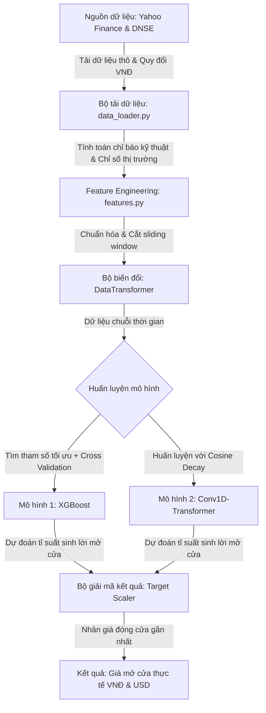

# HƯỚNG DẪN KIẾN TRÚC & NGUYÊN LÝ HOẠT ĐỘNG TOÀN BỘ HỆ THỐNG

Tài liệu này giải thích chi tiết từ đầu đến cuối về nguyên lý thiết kế, luồng dữ liệu, và cách thức hoạt động của các thành phần trong dự án **Dự đoán Giá Mở Cửa Cổ Phiếu (Stock Opening Price Prediction)**.

---

## 🗺️ SƠ ĐỒ LUỒNG HOẠT ĐỘNG TỔNG QUAN (DATAFLOW)

Dữ liệu di chuyển qua hệ thống theo quy trình tuyến tính khép kín dưới đây:

---

## 1. NGUYÊN LÝ THIẾT KẾ CỐT LÕI (CORE PRINCIPLES)

### 📌 Tại sao không dự đoán trực tiếp giá tuyệt đối?
Trong tài chính, việc sử dụng trực tiếp giá cổ phiếu (ví dụ: $150, $155) để huấn luyện mô hình học máy rất dễ dẫn đến hiện tượng **Overfitting** và **Trễ xu hướng** (mô hình chỉ đơn giản lặp lại giá ngày hôm qua). Giá cổ phiếu là một chuỗi không dừng (non-stationary).
*   **Giải pháp:** Dự án này chuyển bài toán sang **dự báo tỉ suất sinh lời (return)**.
*   **Công thức mục tiêu:** 
    $$\text{Target Return} = \frac{\text{Giá mở cửa ngày } T - \text{Giá đóng cửa ngày } T-1}{\text{Giá đóng cửa ngày } T-1}$$
*   Sau khi mô hình dự báo được tỷ lệ phần trăm chênh lệch này, hệ thống sẽ nhân ngược lại với giá đóng cửa gần nhất để ra giá mở cửa tuyệt đối theo VNĐ hoặc USD.

### ⏱️ Cơ chế Cắt Cửa Sổ Trượt (Sliding Window / Lookback Window)
Mô hình không chỉ nhìn vào ngày hôm nay để dự đoán ngày mai, mà sử dụng một khoảng lịch sử dài **45 ngày** (`LOOKBACK_WINDOW = 45`). 
*   Đầu vào của mô hình Deep Learning có dạng 3 chiều: `(Số mẫu, 45 ngày, Số đặc trưng)`.
*   Điều này giúp Transformer tìm kiếm được các mối quan hệ tuần hoàn và xu hướng ngắn-trung hạn.

---

## 2. CHI TIẾT CÁC THÀNH PHẦN (COMPONENT ANALYSIS)

### 📂 Bộ tải dữ liệu (`src/data_loader.py`)
Nhiệm vụ chính: Thu thập dữ liệu từ các nguồn chính thống và làm sạch.
*   **Đa nguồn lực chọn:**
    - Đối với mã Việt Nam (`VNM.VN`): Tải dữ liệu từ năm 2012–2019 qua **DNSE/Entrade API** nhằm vượt qua giới hạn dữ liệu cũ của Yahoo Finance, sau đó nối với dữ liệu mới từ Yahoo Finance.
    - Đối với mã Mỹ (`GOOGL`, `META`): Tải trực tiếp từ **Yahoo Finance**.
*   **Đồng nhất tiền tệ (Quy đổi USD sang VNĐ):** 
    - Để huấn luyện gộp chung và đánh giá trực quan, giá của các mã Mỹ được nhân với tỷ giá `USD_TO_VND = 25.400` để chuyển toàn bộ về thang đo VNĐ.
*   **Tải chỉ số thị trường vĩ mô (Market Index):**
    - Tải dữ liệu quỹ **VanEck Vietnam ETF (`VNM`)** làm đại diện cho thị trường Việt Nam và **S&P 500 (`^GSPC`)** cho thị trường Mỹ để tính toán biến động vĩ mô chung.

---

### 🎛️ Feature Engineering (`src/features.py`)
Mã nguồn này quản lý lớp `DataTransformer` chịu trách nhiệm tạo ra **15 đặc trưng kỹ thuật và vĩ mô** từ dữ liệu giá thô:

1.  `rsi_14`: Chỉ số sức mạnh tương đối (đo lường quá mua/quá bán).
2.  `macd`, `macdh`, `macds`: Các đường trung bình động hội tụ phân kỳ (đo lường động lượng).
3.  `volatility_20`: Độ lệch chuẩn của tỷ suất sinh lời trong 20 ngày (đo lường mức độ rủi ro).
4.  `close_lag1`: Giá đóng cửa ngày hôm trước (tạo liên kết trễ thời gian).
5.  `volume_change`: Tỷ lệ thay đổi khối lượng giao dịch.
6.  `intraday_return`: Tỷ suất sinh lời nội trong ngày giao dịch trước.
7.  `bb_lower`, `bb_middle`, `bb_upper`: Dải Bollinger Bands (xác định biên độ biến động giá).
8.  `atr_14`: Khoảng dao động thực tế trung bình (đo lường độ biến động tuyệt đối).
9.  `ema_14`: Đường trung bình động lũy thừa (làm mượt nhiễu giá).
10. `roc_10`: Tỷ lệ thay đổi giá trong 10 phiên.
11. `adx_14`: Chỉ số định hướng trung bình (đo lường độ mạnh yếu của xu hướng).
12. `market_return`: **[Đặc trưng mới]** Tỷ suất sinh lời của chỉ số thị trường vĩ mô tham chiếu.

*   **Chuẩn hóa dữ liệu:** Sử dụng `StandardScaler` để đưa tất cả các đặc trưng về phân phối chuẩn (trung bình = 0, độ lệch chuẩn = 1), giúp mạng Neural hội tụ tốt hơn.

---

### 🧠 Các kiến trúc mô hình AI (`src/ai_models.py`)

Hệ thống sử dụng phương pháp **"Song mã"** kết hợp giữa Học máy truyền thống và Học sâu:

#### 🌳 1. Mô hình XGBoost (Extreme Gradient Boosting)
*   **Cơ chế:** Là thuật toán cây quyết định tăng cường hiệu năng cao. Đầu vào được làm phẳng (flatten) từ 3D `(45, 15)` thành 2D `(675,)`.
*   **Tối ưu hóa tốc độ:** Sử dụng `RandomizedSearchCV` quét ngẫu nhiên 6 cấu hình siêu tham số tối ưu thay vì quét toàn bộ lưới (Grid Search), giúp giảm thời gian huấn luyện từ 10 phút xuống dưới 2 phút mà không làm giảm độ chính xác.
*   **Cross Validation:** Áp dụng `TimeSeriesSplit(n_splits=5)` để chia dữ liệu kiểm thử theo dòng thời gian tăng dần, đảm bảo không xảy ra hiện tượng rò rỉ dữ liệu tương lai (Data Leakage).

#### 🤖 2. Mô hình lai ghép Conv1D-Transformer (Hybrid Architecture)
Kiến trúc mô hình được thiết kế độc quyền gồm các khối tuần tự:
1.  **Lớp Conv1D (Convolutional 1D):** Đứng ngay sau lớp Input để trích xuất các đặc trưng cục bộ liền kề trong chuỗi thời gian ngắn hạn (kích thước bộ lọc là 128, kernel_size = 3).
2.  **Layer Normalization:** Giữ cho phân phối đầu ra của Conv1D ổn định.
3.  **Positional Embedding:** Mã hóa thông tin thứ tự thời gian của các ngày trong chuỗi 45 ngày.
4.  **Multi-Head Attention (2 khối):** Tìm hiểu mối tương quan dài hạn giữa các ngày trong quá khứ.
5.  **Flatten & Dense Layers:** Chuyển đổi ma trận đặc trưng về dạng vector 1D và đưa qua các lớp Dropout (0.2) để chống overfitting trước khi ra giá trị dự đoán cuối cùng.
6.  **Cosine Decay Scheduler:** Hạ dần tốc độ học (Learning Rate) mượt mà theo hình sóng Cosine từ `1e-4` về `1e-5` giúp mô hình hội tụ ổn định.

---

## 3. NGUYÊN LÝ VÀ QUY TRÌNH HUẤN LUYỆN AI (AI TRAINING PRINCIPLES)

Quá trình huấn luyện các mô hình trong hệ thống tuân theo các nguyên lý khoa học dữ liệu nghiêm ngặt để đảm bảo khả năng dự báo thực tế tốt nhất:

### A. Phân tách Dữ liệu theo Dòng thời gian (Chronological Train/Test Split)
*   **Vấn đề:** Trong dữ liệu chuỗi thời gian, việc xáo trộn ngẫu nhiên dữ liệu (Random Shuffle Split) sẽ tạo ra hiện tượng **Rò rỉ dữ liệu tương lai (Data Leakage)**. Mô hình sẽ học thông tin của ngày $T+1$ để dự báo ngày $T$, điều này làm sai số tập huấn luyện cực kỳ thấp nhưng thất bại hoàn toàn khi chạy thực tế.
*   **Giải pháp:** Hệ thống chia dữ liệu hoàn toàn theo trục thời gian tuyến tính:
    - **80% dữ liệu cũ hơn** được đưa vào làm tập huấn luyện (Train Set) để mô hình học các quy luật lịch sử.
    - **20% dữ liệu mới nhất gần đây** được giữ lại làm tập kiểm thử độc lập (Test Set) dùng để chấm điểm sai số cuối cùng.

### B. Cơ chế Huấn luyện & Tối ưu hóa mô hình XGBoost
*   **Hàm mất mát tối ưu (Loss Function):** Sử dụng sai số bình phương tối thiểu `reg:squarederror` nhằm phạt nặng các dự đoán lệch xa so với thực tế.
*   **Tìm kiếm Siêu tham số (Hyperparameter Tuning):**
    - Áp dụng phương pháp **TimeSeriesSplit (5 folds)**: Mô hình thực hiện kiểm thử chéo tăng dần theo dòng thời gian (không xáo trộn) để đánh giá độ ổn định.
    - Sử dụng **RandomizedSearchCV** để quét ngẫu nhiên 6 cấu hình của các tham số:
        *   `n_estimators` (Số lượng cây quyết định).
        *   `max_depth` (Độ sâu tối đa của mỗi cây, khống chế từ 3 đến 6 để tránh quá khớp).
        *   `learning_rate` (Tốc độ co tỷ lệ học tập để kiểm soát tốc độ hội tụ).
        *   `subsample` & `colsample_bytree` (Tỷ lệ lấy mẫu dữ liệu và lấy mẫu đặc trưng ngẫu nhiên giúp tăng tính đa dạng của các cây quyết định).

### C. Cơ chế Huấn luyện mạng lai ghép Conv1D-Transformer
Mạng Deep Learning được cấu hình với các tham số huấn luyện chuyên sâu:
*   **Thuật toán tối ưu (Optimizer):** `Adam` (Adaptive Moment Estimation) tự động điều chỉnh tốc độ học cho từng trọng số dựa trên các trung bình động lũy thừa của gradient và bình phương gradient.
*   **Hàm mất mát (Loss Function):** `mean_squared_error` (MSE) đo lường sai số bình phương của tỷ suất sinh lời dự đoán so với thực tế.
*   **Cơ chế dừng sớm (Early Stopping):**
    - Hệ thống liên tục giám sát sai số trên tập kiểm tra độc lập (`val_loss`).
    - Nếu sau **10 epochs** liên tiếp (`patience=10`) mà sai số trên tập kiểm thử không giảm thêm, quá trình huấn luyện sẽ lập tức dừng lại.
    - Trọng số tốt nhất đạt được trước đó sẽ được khôi phục (`restore_best_weights=True`) để chống hiện tượng **Overfitting** (mô hình học thuộc lòng nhiễu của tập Train).
*   **Cosine Decay Learning Rate Scheduler (Điều phối tốc độ học hình Cosine):**
    - Ban đầu, tốc độ học được đặt ở mức cao `1e-4` để đẩy nhanh quá trình điều chỉnh các trọng số lớn.
    - Qua từng epoch, tốc độ học được hạ dần theo biên độ hàm Cosine xuống mức tối thiểu `1e-5` ở epoch thứ 100.
    - Việc hạ tốc độ học về cuối giúp mô hình thực hiện các bước điều chỉnh nhỏ và tinh tế, tránh tình trạng dao động hoặc chệch hướng khi đã ở gần điểm tối ưu toàn cục.

---

## 4. QUY TRÌNH CHẠY CHÍNH CỦA PIPELINE (`main.py`)

Khi bạn thực thi lệnh `python main.py`, hệ thống sẽ tự động thực hiện tuần tự các bước sau:

1.  **Huấn luyện độc lập (Individual Training = True):**
    - Vòng lặp duyệt qua từng cổ phiếu trong danh sách `["VNM.VN", "GOOGL", "META"]`.
    - Gọi `src/data_loader.py` tải dữ liệu thô, đồng nhất tiền tệ và tạo đặc trưng `market_return`.
    - Chuyển đổi dữ liệu chuỗi thời gian 3D qua lớp `DataTransformer` và phân tách Train/Test.
    - Thực hiện huấn luyện XGBoost (quét siêu tham số) và huấn luyện Conv1D-Transformer (áp dụng Cosine Decay & Early Stopping).
2.  **Đánh giá sai số (Evaluation):**
    - Sử dụng các mô hình đã học để đưa ra dự đoán trên 20% dữ liệu Test độc lập.
    - Thực hiện giải chuẩn hóa ngược (Inverse Scaling) để chuyển tỷ suất sinh lời thành giá trị tiền mặt VNĐ/USD tuyệt đối.
    - Tính toán sai số **RMSE**, **MAE** (lệch bao nhiêu tiền trung bình trên một phiên), và **MAPE** (tỷ lệ lệch %).
    - Vẽ và lưu biểu đồ trực quan hóa xu hướng giá thực tế vs dự báo vào thư mục `results/`.
3.  **Dự báo phiên kế tiếp (Real-time Inference - Bước 8):**
    - Kết nối yfinance tải trực tuyến dữ liệu giao dịch 150 ngày gần nhất của cổ phiếu đó và chỉ số thị trường vĩ mô tham chiếu.
    - Tính toán toàn bộ 15 đặc trưng kỹ thuật và vĩ mô thời gian thực.
    - Sử dụng mô hình đã huấn luyện dự báo giá mở cửa cho ngày giao dịch hành chính tiếp theo bằng tiền mặt tuyệt đối.
