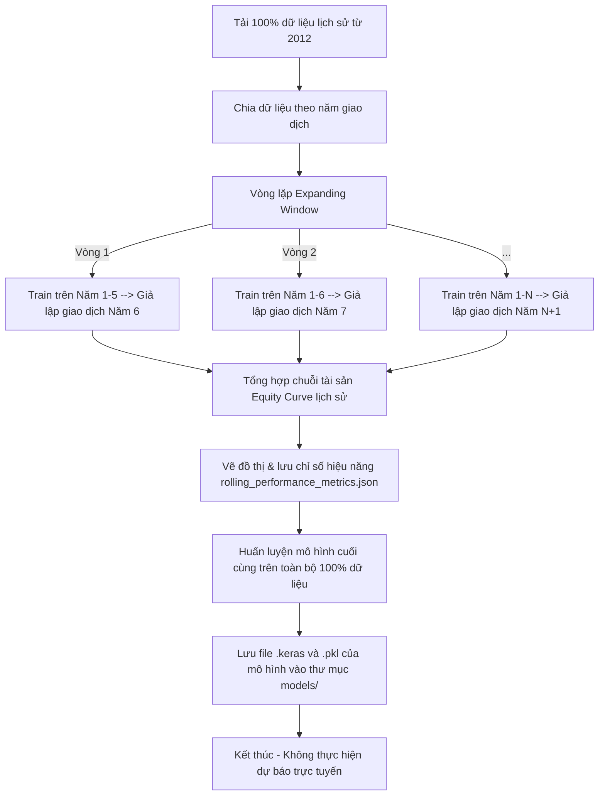

# Kế hoạch triển khai: Tích hợp Huấn luyện Cuộn chiếu & Đổi tên thành `run_training_transformer.py`

Đề xuất tích hợp trực tiếp quy trình huấn luyện cuộn chiếu mở rộng (Expanding Window Walk-Forward) và đánh giá lịch sử vào file huấn luyện chính, đồng thời **đổi tên file script huấn luyện từ `run_training.py` thành `run_training_transformer.py`** để phân biệt rõ ràng vai trò của nó.

Đồng thời, **loại bỏ hoàn toàn phần "Live Prediction" (Dự báo trực tuyến) ở cuối file huấn luyện** để tránh trùng lặp mã nguồn, vì toàn bộ logic dự báo trực tuyến và gửi cảnh báo Telegram đã được đảm nhiệm độc lập bởi file [predict.py](file:///c:/Users/ACER/Documents/Stock-Opening-Price-Prediction/scripts/predict.py).

---

## Quy trình hoạt động mới của `run_training_transformer.py`



## Phân chia trách nhiệm rõ ràng giữa các Script:

1. **`run_training_transformer.py`**: Chỉ chịu trách nhiệm **huấn luyện** (bao gồm chạy thử nghiệm cuộn chiếu lịch sử, lưu báo cáo hiệu suất quá khứ, và huấn luyện/lưu mô hình Transformer + XGBoost cuối cùng trên toàn bộ dữ liệu).
2. **`predict.py`**: Chỉ chịu trách nhiệm **dự báo trực tuyến** (nạp mô hình đã lưu từ `run_training_transformer.py`, tải dữ liệu mới nhất hôm nay, chạy các Agent tranh luận, xuất báo cáo dự báo ngày mai và gửi Telegram).

---

## Các thay đổi chi tiết

### 1. Đổi tên và cập nhật các liên kết gọi file

- Đổi tên file từ `scripts/run_training.py` thành `scripts/run_training_transformer.py`.
- Cập nhật tất cả các lệnh gọi và tài liệu tham chiếu đến `run_training.py` trong:
  - `scripts/predict.py`
  - `scripts/run_all_manual.bat`
  - `scripts/run_full_pipeline.bat`
  - `scripts/run_tuning.py`
  - `scripts/run_backtest.py`
  - `src/data_loader.py`
  - `README.md`

### 2. Thay đổi cấu trúc huấn luyện cuộn chiếu trong `run_training_transformer.py`

- **Bước 1: Chia cửa sổ cuộn chiếu**:
  - Xác định thời điểm huấn luyện ban đầu (ví dụ: dữ liệu 5 năm đầu tiên kể từ mốc thời gian bắt đầu).
  - Thiết lập chu kỳ cập nhật mô hình (ví dụ: huấn luyện lại định kỳ sau mỗi 252 phiên giao dịch ~ 1 năm).
- **Bước 2: Vòng lặp huấn luyện Expanding Window**:
  - Trong mỗi vòng lặp, huấn luyện mô hình Transformer và XGBoost Stacking trên dữ liệu lũy kế tính đến năm $N$.
  - Để tối ưu hóa thời gian huấn luyện trên CPU, các mô hình trong vòng lặp cuộn chiếu có thể huấn luyện nhanh với số Epoch thấp hơn (15-20 Epochs) hoặc sử dụng cơ chế **Warm Start** (nạp trọng số của vòng trước đó và huấn luyện tiếp 10 Epochs với dữ liệu mở rộng).
  - Sử dụng mô hình vừa huấn luyện để dự báo và mô phỏng giao dịch liên tục cho năm tiếp theo (năm $N+1$).
  - Lưu lại lịch sử giao dịch và tài sản (Equity) lũy kế.
- **Bước 3: Tổng hợp hiệu suất**:
  - Vẽ đồ thị Equity Curve liên tục và tính toán các chỉ số Win Rate, Sharpe, Max Drawdown tổng hợp từ kết quả của các năm kiểm thử độc lập.
  - Lưu chỉ số hiệu năng vào file `config/rolling_performance_metrics_{ticker}.json`.
- **Bước 4: Huấn luyện mô hình sản xuất cuối cùng**:
  - Tiến hành huấn luyện mô hình Transformer + XGBoost trên **100% dữ liệu lịch sử** (đến thời điểm hiện tại) với số epoch đầy đủ (ví dụ: 50-100 Epochs) để đảm bảo độ chính xác tối đa khi dự báo thực tế.
  - Lưu mô hình chính thức dưới định dạng `transformer_model_{ticker}.keras` và `xgboost_model_{ticker}.pkl` để phục vụ Web Dashboard API.

### 3. Xóa bỏ phần dự báo trực tuyến thừa trong `run_training_transformer.py`

- **Xóa bỏ hoàn toàn** khối logic dự báo trực tuyến thừa tải dữ liệu live từ `yf.download`, dự báo và xuất log/Telegram.

---

## Kế hoạch kiểm thử & Xác minh

### 1. Kiểm tra Huấn luyện

- Chạy thử nghiệm lệnh huấn luyện cuộn chiếu cho một mã cổ phiếu (ví dụ: `META`):
  ```powershell
  python scripts/run_training_transformer.py META
  ```
- Xác nhận:
  - Script chạy huấn luyện cuộn chiếu thành công và vẽ đồ thị Equity lưu vào `reports/figures/`.
  - Script kết thúc mà không chạy phần dự báo trực tuyến hay gửi Telegram.
  - Mô hình Transformer (`.keras`) và XGBoost (`.pkl`) cuối cùng đã được lưu thành công trong thư mục `models/`.

### 2. Kiểm tra Dự báo

- Chạy thử lệnh dự báo trực tuyến bằng script độc lập:
  ```powershell
  python scripts/predict.py META
  ```
- Xác nhận:
  - Mô hình vừa được huấn luyện hoạt động ổn định và đưa ra kết quả dự báo chính xác trên `predict.py`.
  - Báo cáo Multi-Agent và cảnh báo Telegram được tạo đúng định dạng.
